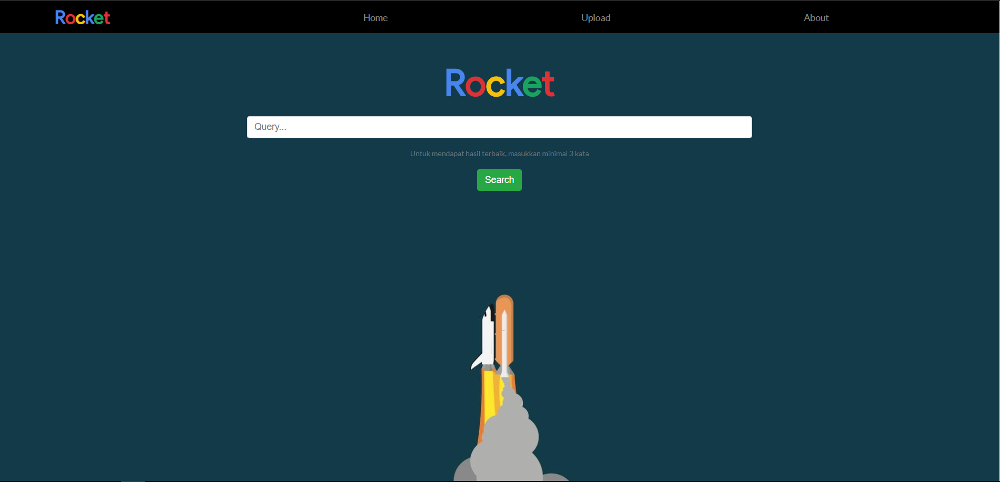
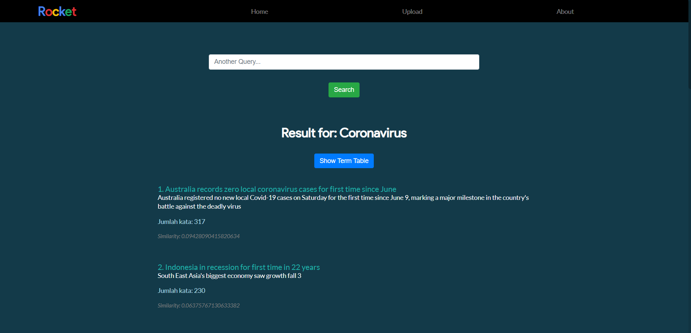

# Tugas Besar 2 - Aljabar Linear dan Geometri


> Aplikasi Dot Product pada Sistem Temu Balik Informasi

### Kelompok 8 - tasdasdadwda
| Anggota | NIM |
| --- | --- |
|Rexy Gamaliel R. | 13519010 |	
|Dionisius Darryl H. | 13519058 |	
|Wilson Tandya | 13519209 |

## Table of contents
* [General info](#general-info)
* [Screenshots](#screenshots)
* [Folder structure](#structure)
* [Technologies](#technologies)
* [Setup](#setup)
* [Features](#features)

## General info
Search engine dalam bentuk website lokal yang merupakan sebuah aplikasi sistem temu balik informasi dengan menggunakan teori dot product pada vektor. Pada website ini, pengguna dapat memasukkan query dan mendapatkan hasil dokumen terurut berdasarkan nilai cosine similarity.

## Screenshots
### Home page


### Upload page


### Result page


<span id='structure'></span>
## Folder structure
```
Algeo02-19010
│
├── src
│   └── client /            [ Frontend ]
│   └── server /            [ Backend ]
│       └── main.py         [ API ]
│       └── program.py
│       └── document.py
│       └── reader.py
│       └── vector.py
│
├── docs
│   └── 8_LaporanTugasBesar2IF2123_tasdasdadwda.docx
│   └── 8_LaporanTugasBesar2IF2123_tasdasdadwda.pdf
│
├── test
│   └── upload              [ Upload database ]
│       └── ... .txt        [ Uploaded test documents ]
│   └── ... .txt            [ Test documents 1 - 17 ]
│
└── README.md
```

## Technologies
* **JavaScript**           : React.js
* **Python**               : Flask
* **Additional Libraries** : NLTK

## Setup
1. Pastikan Node.js, NPM, Python, dan Flask telah terinstall di komputer anda.
2. Clone repository ini pada komputer anda

**Frontend**
1. Masuk ke dalam folder src/client/ dengan command ```cd src/client``` (Relative terhadap directory utama)
2. Install seluruh component npm yang diperlukan dengan ```npm install```
3. Jalankan command ```npm start```
3. Website akan terbuka pada browser dengan alamat localhost:3000

**Backend**
1. Masuk ke dalam folder src/server/ dengan command ```cd src/server``` (Relative terhadap directory utama)
2. Install requirements yang dibutuhkan dengan menjalankan perintah ``` pip install -r requirements.txt ``` atau install secara manual dengan melihat list dependencies yang diperlukan pada ```requirements.txt```
3. Jalankan command ```flask run```
4. Backend telah dijalankan. Pastikan untuk merefresh browser jika terjadi kendala

## Features
* Query search based on cosine similarity
* Showing term frequency table based on query
* Showing original document
* Multiple files upload

## Thank you
