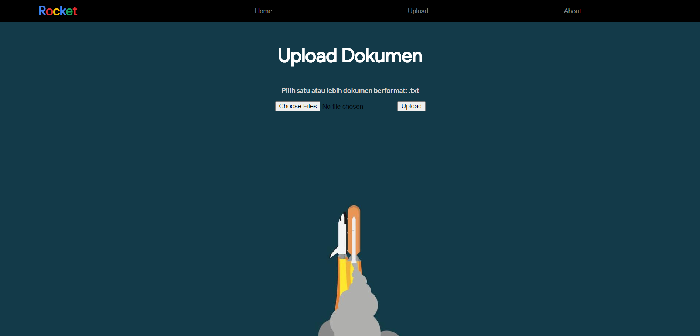

# Rocket Search Engine


> A web-based search engine built with React.js and Flask implementing cosine similarity

| Made by: |
| --- |
|Rexy Gamaliel R. |	
|Dionisius Darryl H. |	
|Wilson Tandya |

## Table of contents
* [General info](#general-info)
* [Screenshots](#screenshots)
* [Folder structure](#structure)
* [Technologies](#technologies)
* [Setup](#setup)
* [Features](#features)

## General info
Rocket is a search engine built using React.js and Flask that applies dot product theory in an information retrieval system. In this web application, user can execute a query to get some documents as a result based on cosine similarity.

## Screenshots
### Home page


### Upload page


### Result page


<span id='structure'></span>
## Folder structure
```
rocket-search-engine
│
├── src
│   └── client /            [ Frontend ]
│   └── server /            [ Backend ]
│       └── main.py         [ API ]
│       └── program.py
│       └── document.py
│       └── reader.py
│       └── vector.py
│
├── docs
│   └── report.pdf
│
├── test
│   └── upload              
│       └── ... .txt       
│   └── ... .txt            
│
└── README.md
```

## Technologies
* **JavaScript**           : React.js
* **Python**               : Flask
* **Additional Libraries** : NLTK

## Setup
1. Make sure that Node.js, Python, and Flask are installed in your local computer.
2. Clone this repository.

**Frontend**
1. Access src/client folder using ```cd src/client```
2. Install all the required NPM components using ```npm install```
3. Execute ```npm start```
4. The website will open in your default local browser (localhost:3000)

**Backend**
1. Access src/server folder using ```cd src/server```
2. Install the requirements needed using ```pip install -r requirements.txt```
3. Execute ```flask run```

## Features
* Query search based on cosine similarity
* Showing term frequency table based on query
* Showing original document
* Multiple files upload

## Thank you
